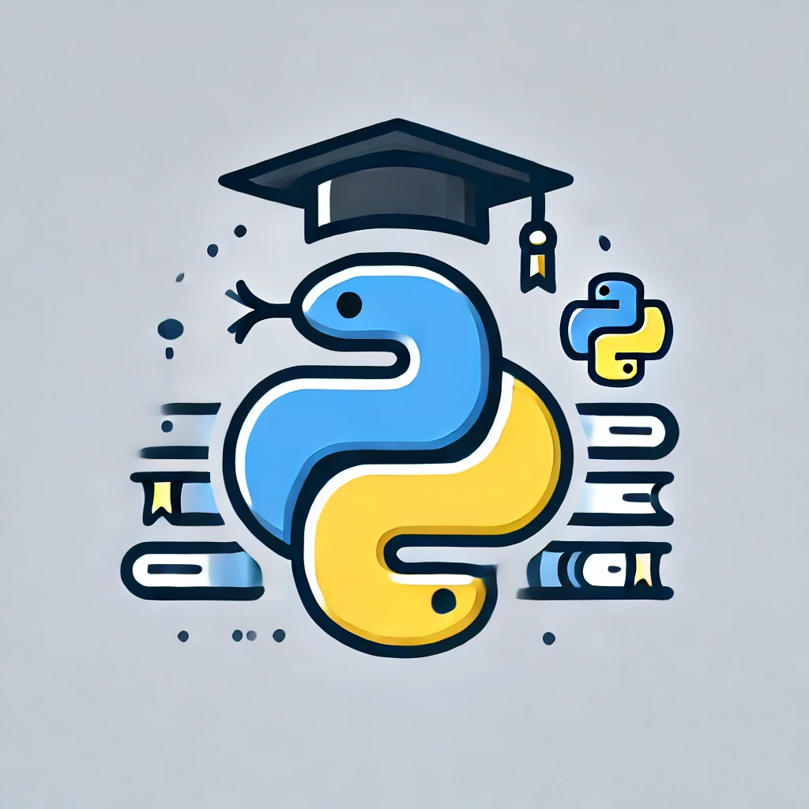

# Python Learning Repository

Welcome to the **Python Learning Repository**! This repository is designed to provide a collection of programming tasks and challenges for students learning Python. Whether you're a beginner or looking to polish your skills, you'll find something here to help you grow.

## Features

- **Structured Exercises**: Tasks are grouped by difficulty and topic.
- **Solutions**: Each exercise includes a well-documented solution.
- **Hands-On Learning**: Focused on practical, real-world Python programming.
- **Continuous Updates**: New tasks are added regularly to keep the content fresh.

## Topics Covered

- Basic Syntax
- Data Structures (Lists, Tuples, Dictionaries, Sets)
- Functions and Modules
- File Handling
- Object-Oriented Programming
- Error Handling
- Libraries (NumPy, Pandas, etc.)

## Getting Started

1. **Clone the Repository**:
   ```bash
   git clone https://github.com/pkisiel/python-learning-repo.git
   ```
2. **Navigate to the Directory**:
   ```bash
   cd python-learning-repo
   ```
3. **Start Learning**:
   Open any topic folder and start working on the tasks.

## Contribution Guidelines

We welcome contributions! To add tasks or improve existing content:

1. Fork the repository.
2. Create a new branch for your feature.
3. Commit your changes.
4. Submit a pull request.

## Community

Join our growing community of learners and educators:

- **Discussions**: Share tips, ask questions, and get help.
- **Issues**: Report bugs or suggest new features.

## License

This repository is licensed under the MIT License. See the [LICENSE](LICENSE) file for details.

---

Happy Learning! 🚀

